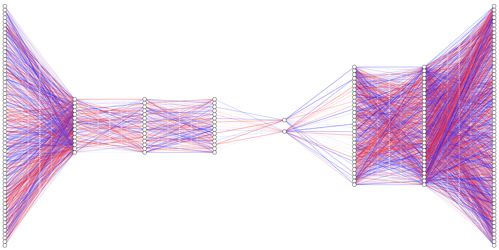

# Autoencoder-for-FPGA
In this repo it is presented an implementation of a Deep Autoencoder architecture trained
on the [MNIST database](https://en.wikipedia.org/wiki/MNIST_database) in [FPGA](https://en.wikipedia.org/wiki/Field-programmable_gate_array), focusing on machine vision tasks for the data reconstruction and classification in the latent dimension.
To implement machine learning (ML) models in FPGAs, a companion compiler based on High-Level Synthesis (HLS) called [hls4ml](https://fastmachinelearning.org/hls4ml/#:~:text=hls4ml%20is%20a%20Python%20package,configured%20for%20your%20use%2Dcase!) is used.
Furthermore, an optimization using both compression
and quantization of Neural Networks is performed to obtain sensible reduction in model size, latency and energy consumption.

    

